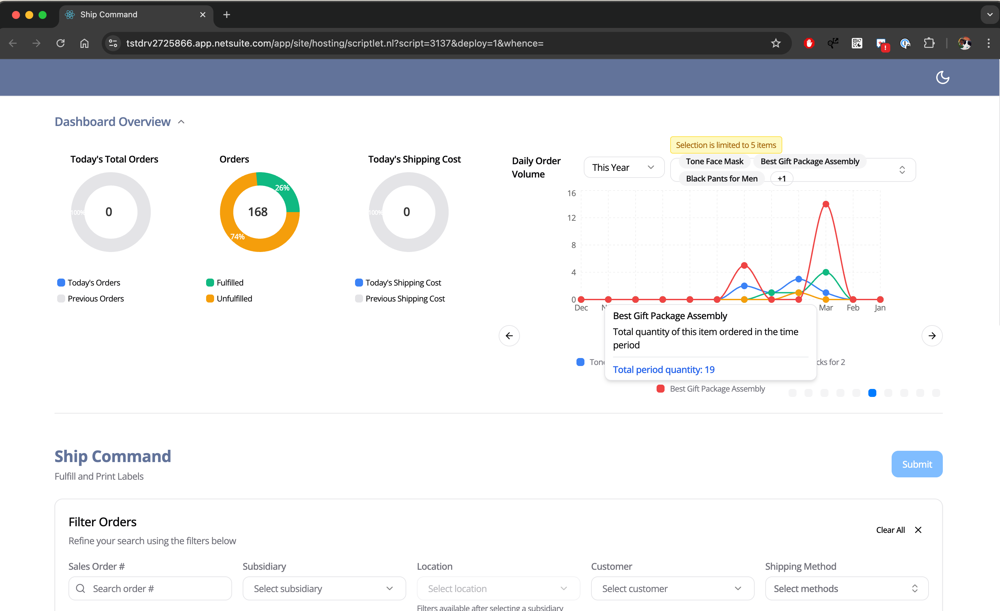

# ShipCommand SuiteApp
A comprehensive order fulfillment and shipping management application

Comes with interactive charts and performance insights on order volume, carrier usage, shipping costs, delivery times, and more

### Step 1: Clone the repository using the project's Git URL
git clone https://github.com/ccnael/shipcommand-react-app.git

### Step 2: Navigate to the project directory
cd /src/vite-react-app

### Step 3: Install the necessary dependencies
npm i

### Step 4: Start the development server with auto-reloading and an instant preview
npm run dev

### Step 5: Build and deploy
- npm run build 
- deploy project

### Techstack
- Vite
- TypeScript
- React
- shadcn-ui
- Tailwind CSS

### UI

